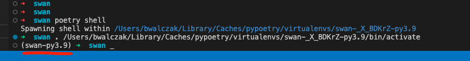
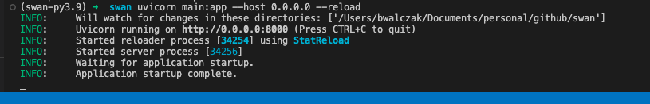
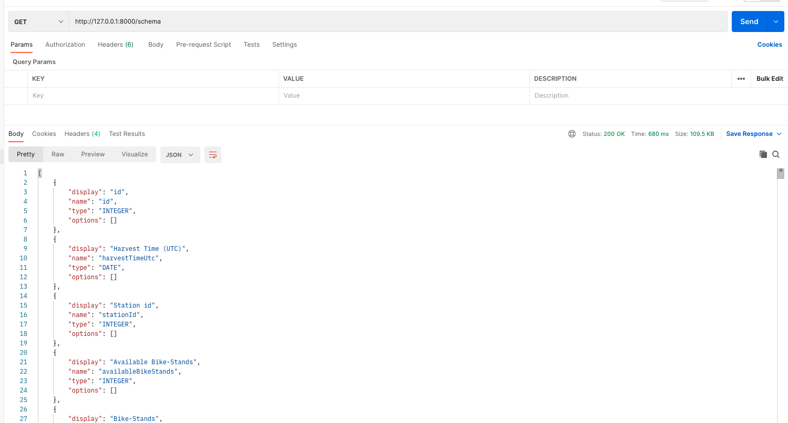
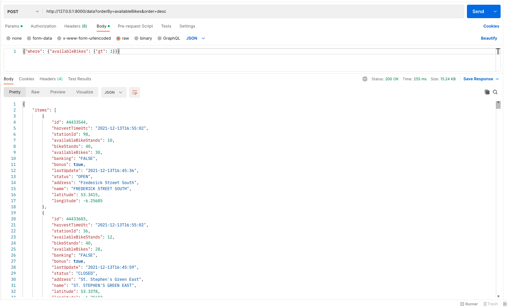
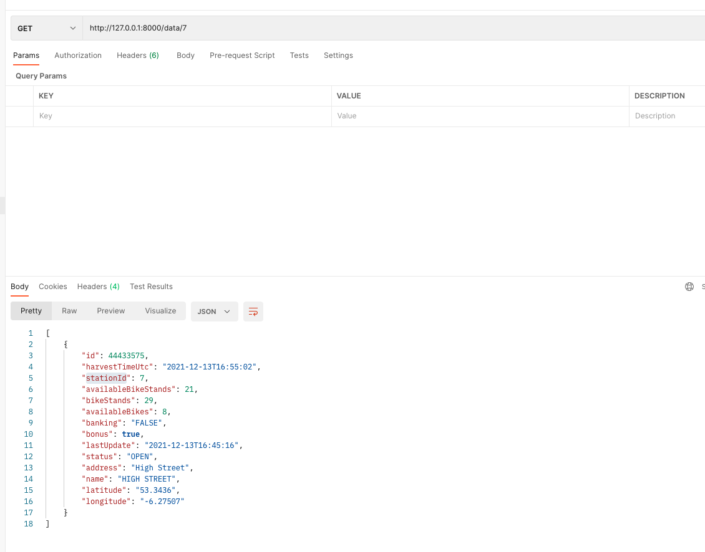
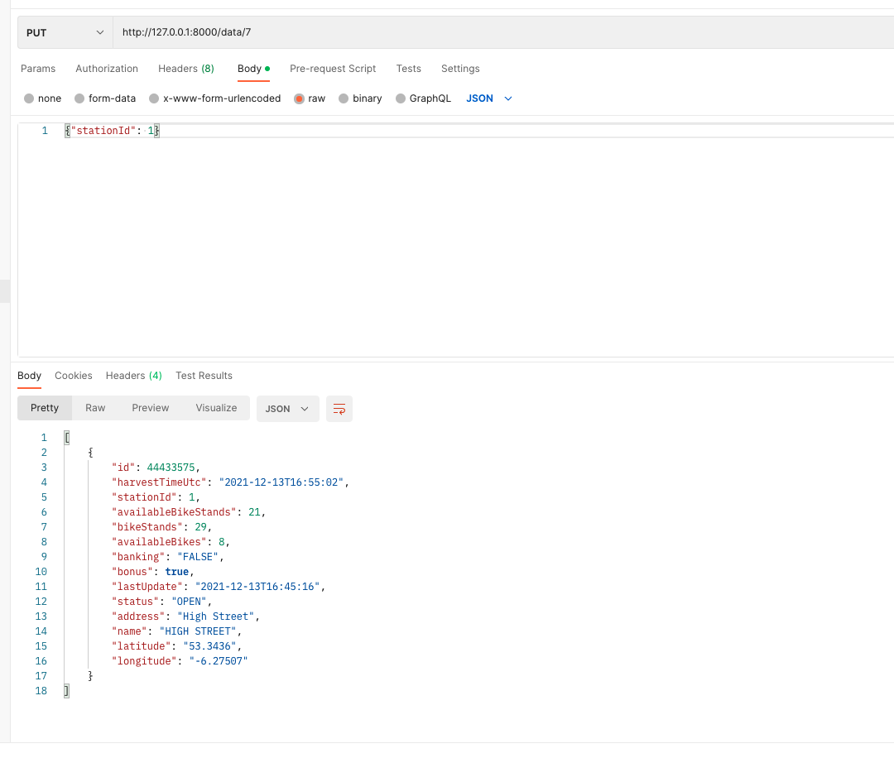

# Swan awesome app

Here's Swan awesome app! Implemented with Fastapi, Pydantic and uvicorn

### Completed requirements:  
* generate and return json schema based from json response:  
```GET: /schema```
* return data from Dublin Bikes dataset, apply filters if any:  
```POST: /data```  
### Extra Features:  
* orderBy, (with descending feature), ie:  
```GET: /data?orderBy=availableBikes```  
```GET: /data?orderBy=availableBikes&order=desc```
* get station by id:  
```GET: /data/:id```
* update station by id:  
```PUT: /data/:id```

## Installation

1. Make sure you have python installed (minimum version 3.9)
2. [Install poetry](https://python-poetry.org/docs/)
```bash
curl -sSL https://install.python-poetry.org | python3 -
```
3. From project root dir, run:
```bash
poetry shell
```
After above command, you should be in virtualenv. Your terminal should look similar to this one:



```bash
poetry install
``` 
After above command all dependencies should be installed in virtualenv


## Usage

Run app, with uvicorn:

```bash
uvicorn main:app --host 0.0.0.0 --reload
```
`--reload` is optional, if you don't care about hot reloading you can run app without it.  



If everything went well you should see similar output to the one above

> **_NOTE:_**  Fastapi is serving documentation at: http://127.0.0.1:8000/docs


## Test Results:
1. generate and return json schema based from json response:  
```GET: /schema```
```bash
curl --location --request GET 'http://127.0.0.1:8000/schema'
```


2. Return data from Dublin Bikes dataset, apply filters if any:  
```POST: /data```  
```bash
curl --location --request POST 'http://127.0.0.1:8000/data?orderBy=availableBikes' \
--header 'Content-Type: application/json' \
--data-raw '{"where": {"availableBikes": {"gt": 1}}}'
```  

### Extra Features:  
3. OrderBy, (with descending feature), ie:  
```GET: /data?orderBy=availableBikes```  
```GET: /data?orderBy=availableBikes&order=desc```
```bash
curl --location --request POST 'http://127.0.0.1:8000/data?orderBy=availableBikes&order=desc' \
--header 'Content-Type: application/json' \
--data-raw '{"where": {"availableBikes": {"gt": 1}}}'
```

4. Get station by id:  
```GET: /data/:id```
```bash
curl --location --request GET 'http://127.0.0.1:8000/data/7'
```

5. Update station by id:  
```PUT: /data/:id```
```bash
curl --location --request PUT 'http://127.0.0.1:8000/data/7' \
--header 'Content-Type: application/json' \
--data-raw '{"stationId": 1}'
```

